# 分析基盤構築演習のまとめ

---
# アジェンダ

1. 本演習について
2. やったこと
3. やらなかったこと
4. 基盤の全体像
5. 学んだこと
6. 今後学ぶべきこと

---
# 本演習について
## 概要
- GCPのサービスを使用して、「データレイク⇨DWH」のETLパイプラインを構築する。

## 目的
- 次のプロジェクトでスムーズにキャッチアップできるようにするため

---
# やったこと
## 学習→実践の順で進めた
- 7/4,7/5
  - BigQueryとパイプラインについて動画教材で学習
    - **[Modernizing Data Lakes and Data Warehouses with GCP 日本語版](https://www.coursera.org/learn/data-lakes-data-warehouses-gcp-jp?specialization=gcp-data-engineering-jp)**
    - **[Building Batch Data Pipelines on GCP 日本語版](https://www.coursera.org/learn/batch-data-pipelines-gcp-jp?specialization=gcp-data-engineering-jp)**

- 7/6,7/7,7/8
  - 実際にGCPでETLパイプライン、ワークフローを構築

---
# やらなかったこと
- DWHのテーブル設計
  - 非正規化
  - パーティション
- 複数データソースの統合
- 厳密なワークフロー設定
- BIツールとの連携
  - 時間切れのため断念

---
# 基盤の全体像


---
# 学んだこと
## GCPに関して
- Data Fusion,Cloud Composer,Cloud Functionsなどの最低限の使い方
- Data FusionとCloud Composerの違いが腑に落ちた
  - Data Fusion：ETLのパイプラインをGUIで作成できる
    - 扱うデータごとに作成するイメージ
  - Cloud Composer
    - 複数のパイプラインなどの処理を統合的に管理する
- ググっても情報が少ないので、チーム内でのナレッジ共有が重要

---
## 作業の進め方など
- ベストプラクティスやチュートリアルなど既にできているものをカスタマイズしていく方が間違いない
  - チュートリアルで動くことを確認 → 自分の形に変えて試してみる
- やらないことを整理すると、やるべきことがクリアになって進めやすい

---
# 今後学ぶべきこと
- DWHの設計
  - 非正規化(スタースキーマetc...)
- BigQueryの操作
  - 構造体に対するSQL
- GCPの権限設定
- Airflowのエラー時の構成

---
# ハマった部分
## Data Fusionのパイプラインの実行が失敗する
### 事象
1. Dataprocのクラスタが作成できない
   
```bash
Failed to create cluster cdap-datafusio-e63b1315-fd8d-11ec-9e4a-d281f729ea5e: 
The zone 'projects/cedar-setup-355408/zones/us-west1-a' does not have enough resources available to fulfill the request. 
Try a different zone, or try again later.
```

2. 複数回実行するとディスクサイズの上限に関するエラーが発生し、数時間使用できない

```bash
PROVISION task failed in REQUESTING_CREATE state for program run program_run:
default.DataFusionQuickstart.-SNAPSHOT.workflow.DataPipelineWorkflow.c3ee1964-fd8d-11ec-bb48-d281f729ea5e due to Dataproc operation failure: 
INVALID_ARGUMENT: Insufficient 'DISKS_TOTAL_GB' quota. Requested 3000.0, available 1996.0..
```

---
### 対応内容
- Data Fusionを実行するサービスアカウントに「編集者」権限を付与した。
  - 編集者権限がないことが原因で「クラスタの作成」「ディスク割り当ての整理」とかできなかった？


